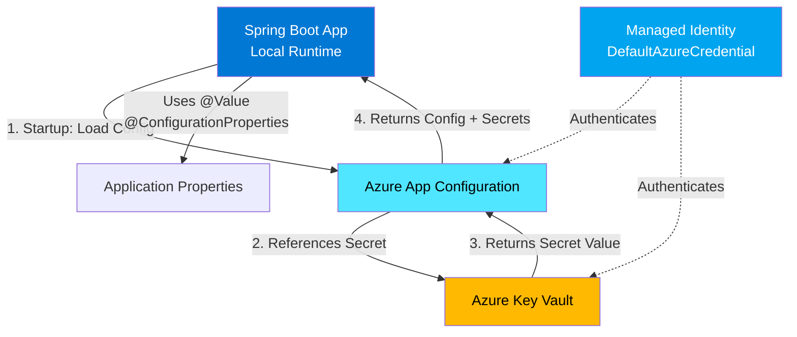

# Spring Boot Azure App Configuration Demo

## Blog Article

> **📝 Read the companion blog post:** [A Spring Boot Developer's Guide to Azure App Configuration](https://akhan-2020.github.io/java/azure/2026/05/25/spring-boot-azure-app-configuration-guide/)

This demo shows how to integrate Spring Boot with Azure App Configuration and Key Vault using Spring Cloud Azure.

## Architecture



## Prerequisites

1. Azure subscription
2. Azure CLI installed and authenticated (`az login`)
3. Java 21
4. Maven 3.9+

## Setup Azure Resources

```bash
# Create resource group
az group create --name rg-appconfig-demo --location eastus

# Deploy infrastructure
az deployment group create \
  --resource-group rg-appconfig-demo \
  --template-file infra/main.bicep \
  --parameters userObjectId=$(az ad signed-in-user show --query id -o tsv)

# Get the App Configuration endpoint
APP_CONFIG_ENDPOINT=$(az appconfig show \
  --resource-group rg-appconfig-demo \
  --name <your-appconfig-name> \
  --query endpoint -o tsv)

# Get the Key Vault name
KEY_VAULT_URI=$(az keyvault show \
  --resource-group rg-appconfig-demo \
  --name <your-keyvault-name> \
  --query properties.vaultUri -o tsv)
```

## Configure Application

Update `src/main/resources/application.properties`:
- Replace `YOUR_APPCONFIG_NAME` with your App Configuration store name
- Replace `YOUR_KEYVAULT_NAME` with your Key Vault name

## Add Key Vault Reference in App Configuration

```bash
# Add a Key Vault reference in App Configuration
az appconfig kv set-keyvault \
  --name <your-appconfig-name> \
  --key database-password \
  --secret-identifier https://<your-keyvault-name>.vault.azure.net/secrets/database-password
```

## Run the Application

```bash
mvn clean spring-boot:run
```

Visit: http://localhost:8080/

Expected output:
```json
{
  "message": "Hello from Azure App Configuration!",
  "databasePasswordConfigured": "true",
  "source": "Azure App Configuration + Key Vault"
}
```

## How It Works

1. **Spring Boot starts** and initializes Spring Cloud Azure property sources
2. **DefaultAzureCredential** authenticates using Azure CLI credentials (locally)
3. **App Configuration** is queried for `app.message` and `database-password` keys
4. For `database-password`, App Configuration returns a **Key Vault reference**
5. Spring Cloud Azure **automatically resolves** the Key Vault secret
6. Properties are available via `@Value` and `@ConfigurationProperties`

## Environment-Specific Configuration with Labels

```bash
# Add dev-specific config
az appconfig kv set --name <your-appconfig-name> \
  --key app.message --value "Dev Environment" --label dev

# Add prod-specific config
az appconfig kv set --name <your-appconfig-name> \
  --key app.message --value "Production Environment" --label prod
```

Update `application.properties`:
```properties
spring.cloud.azure.appconfiguration.stores[0].selects[0].label-filter=dev
```

## Cleanup

```bash
az group delete --name rg-appconfig-demo --yes --no-wait
```

## Related Blog Post

Read the full guide: [A Spring Boot Developer's Guide to Azure App Configuration](https://akhan-2020.github.io/java/azure/2026/05/25/spring-boot-azure-app-configuration-guide/)
